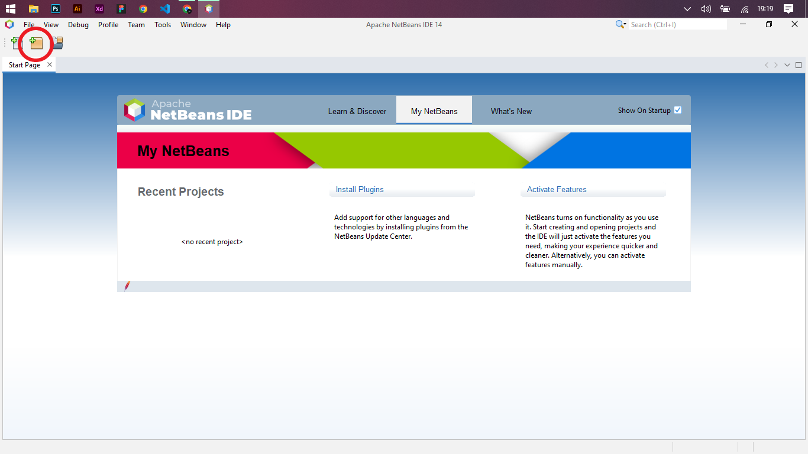

  
  

<h1 align="center">Calculadora simples com Java</h1>

<h3 align="justify">
  Não sabe o que é JAVA?
</h3>

Java é uma ótima linguagem orientada objeto para criar aplicações que fazem utilização de interface gráfica, seja em desktop ou web. Nesse projeto eu quis trazer o desenvolvimento inicial de uma interface gráfica de uma calculadora utilizando a biblioteca swing, pois é essa biblioteca que nos proporciona os recursos para trabalhar com estas interfaces. primeira parte do projeto.

<h3 align="justify">
  Mas, por que fazer justamente uma calculadora?
</h3>

A proposta desse projeto é, trazer uma prática simples, mas também que englobe diversos tópicos e conteúdos importantes na área de Programação Orientada a Objeto (POO) com a linguagem de programação utilizada em questão. Fazer uma calculadora não foi uma ideia escolhida por acaso, esse tipo de aplicação permite a utilização de operadores matemáticos, lógicos e relacionais dentro da linguagem, estes conceitos serão muito importantes caso você ainda não tenha um domínio completo destas funcionalidades.

<h3 align="justify">
  Do que vamos precisar e, por que o Swing?
</h3>

Eu optei por utilizar a biblioteca Swing importada do JDK mais atual do Java, pois, a utilização da mesma proporciona a possibilidade de implementação de interfaces gráficas criadas de maneira simples e bem direta. Para tal feito é necessária a intalação de uma IDE chama NETBEANS, disponibilizada pela Oracle (Empresa Multinacional especializada em desenvolvimento de hardware e software). Logo abaixo você poderá ver o primeiro passo para a criação do projeto.

  

<h3 align="justify">
  Onde estamos?
</h3>

A parte inicial do projeto contará apenas com a estruturação completa de todos os componentes necessários para o início do desenvolvimento da aplicação. Futuramente serão implementadas diversas funcionalidades extras com outras bibliotecas que serão úteis para agregar em conhecimento para vocês que estão iniciando no desenvolvimento mobile. OBS: Nossa aplicação será totalmente voltada para dispositivos que rodam na plataforma Android.

